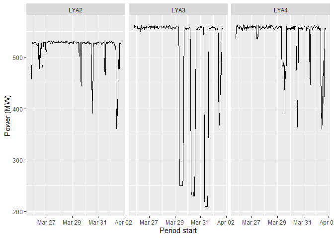
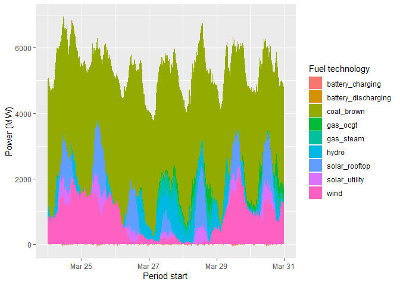

<!-- README.md is generated from README.Rmd. Please edit that file -->

# opennemr

<!-- badges: start -->
<!-- badges: end -->

## Overview

The goal of {opennemr} is to provide simple access to the OpenNEM API
via R.

The OpenNEM project (<https://opennem.org.au>) aims to make Australian
energy network data more accessible to a wider audience through a
website portal and data access API’s and tools.

Through the webport and API, OpenNEM privides access to: \* National
Electricity Market (NEM) data \* Wholesale Electricity Market (WEM) data
\* Australian PV Institute (APVI) data

{opennemr} provides a simple interface for R to access the public API
provided to OpenNEM. Each of the endpoints documented in the API
documentation (<https://api.opennem.org.au/docs>) have been implemented
in opennemr.

## Installation

{opennemr} is not yet available on CRAN.

You can install the development version of opennemr from
[GitHub](https://github.com/) with:

``` r
# if you don't have devtools installed, first run:
# install.packages("devtools")
devtools::install_github("RPBatchelor/opennemr")
```

## Using {opennemr}

The public OpenNEM API (current version 3.13.2-alpha.10) provides access
to two types of data: - **Static lists** such as: \* list of stations
and facilities \* list of networks and network regions \* list of
fueltechs \* time periods and intervals - **Statistics** such as: \*
Facility power and energy data \* Interconnector flows

### Static lists

A key function of opennemr is to download static lists from {opennemr}.
This is a useful first step to build the necessary inputs for later
downloading time series statistc data.

First we’ll load the {opennemr} package and the {tidyverse}

``` r
library(opennemr)
library(tidyverse)
#> ── Attaching packages ─────────────────────────────────────── tidyverse 1.3.2 ──
#> ✔ ggplot2 3.4.1     ✔ purrr   1.0.1
#> ✔ tibble  3.1.8     ✔ dplyr   1.1.0
#> ✔ tidyr   1.3.0     ✔ stringr 1.5.0
#> ✔ readr   2.1.4     ✔ forcats 1.0.0
#> ── Conflicts ────────────────────────────────────────── tidyverse_conflicts() ──
#> ✖ dplyr::filter() masks stats::filter()
#> ✖ dplyr::lag()    masks stats::lag()
```

Now we’ll create some dataframes of the relevant static list data from
the OpenNEM database

``` r
networks <- get_network_list()
stations <- get_station_list()
#> Warning: `cols` is now required when using `unnest()`.
#> ℹ Please use `cols = c(facilities_id, facilities_network, facilities_fueltech,
#>   facilities_status, facilities_station_id, facilities_code,
#>   facilities_dispatch_type, facilities_active, facilities_capacity_registered,
#>   facilities_network_region, facilities_unit_number, facilities_unit_capacity,
#>   facilities_emissions_factor_co2, facilities_approved, facilities_registered,
#>   facilities_approved_at, facilities_approved_by)`.
fueltechs <- get_fueltech_list()
```

### Time series statistics

Now we’ll look to download some actual power data for a given station.
From the *stations* list we know the station code for Loy Yang A is
*LOYYANGA* and this station is on the NEM network. We can get data at 30
minute intervals for a period of 7 days using the below:

``` r
lya_power <- get_power_by_station(network_code = "NEM",
                                  station_code = "LOYYANGA",
                                  interval = "30m", 
                                  period = "7d")
#> Warning: `cols` is now required when using `unnest()`.
#> ℹ Please use `cols = c(facilities_id, facilities_network, facilities_fueltech,
#>   facilities_status, facilities_station_id, facilities_code,
#>   facilities_dispatch_type, facilities_active, facilities_capacity_registered,
#>   facilities_network_region, facilities_unit_number, facilities_unit_capacity,
#>   facilities_emissions_factor_co2, facilities_approved, facilities_registered,
#>   facilities_approved_at, facilities_approved_by)`.
#> Warning: `cols` is now required when using `unnest()`.
#> ℹ Please use `cols = c(history)`.
```

This is what the data looks like:

``` r
str(lya_power)
#> tibble [1,011 × 6] (S3: tbl_df/tbl/data.frame)
#>  $ code        : chr [1:1011] "LYA2" "LYA2" "LYA2" "LYA2" ...
#>  $ network     : chr [1:1011] "nem" "nem" "nem" "nem" ...
#>  $ data_type   : chr [1:1011] "power" "power" "power" "power" ...
#>  $ units       : chr [1:1011] "MW" "MW" "MW" "MW" ...
#>  $ value       : num [1:1011] 460 444 448 460 519 ...
#>  $ period_start: POSIXct[1:1011], format: "2023-03-24 15:30:00" "2023-03-24 16:00:00" ...
```

It’s now very simple to chart the power output of each generator at Loy
Yan A over time

``` r
(p <- lya_power |> 
    ggplot(aes(x = period_start, y = value)) +
    geom_line() +
    facet_wrap(~code) + 
    theme_grey() +
    labs(x = "Period start",
         y = "Power (MW)")
)
```



The period of time over which you can download data for a given station
can be found by running {get_period_list()}. Similarly, the intervals
between data points can be found by running {get_interval_list()}.

**Note** The OpenNEM API developer documentation indicates that start
and end dates can be called within the REST API, but this has not yet
been build into the functionality of {opennem}. For now, specifying the
*period* in the function call will download data from the current date
backwards by the specified duration.

We can also download all power generation data by fueltech for a given
network. Let’s get all generation data for Victoria (region code *VIC1*)
for the month of March 2023.

``` r

vic_power_fueltech <- get_power_by_fueltech_region(network_code = "NEM",
                                                   network_region_code = "VIC1",
                                                   month = "2023-03-01")
```

**Note** The way the API works for this particular endpoint is that both
power and price data are returned

``` r
unique(vic_power_fueltech$type)
#> [1] "power" "price"
```

Therefore,, filter for either of these variables once you’ve got the
data. Below charts power by fueltech for a 1 week period

``` r
(p <- vic_power_fueltech |> 
    filter(period_start >= "2023-03-24",
           period_start < "2023-03-31",
           type == "power") |> 
    ggplot() +
    geom_area(aes(x = period_start,
                  y = value, 
                  fill = fueltech),
              show.legend = TRUE) +
    theme_grey() +
    labs(x = "Period start",
         y = "Power (MW)",
         fill = "Fuel technology")
)
```


