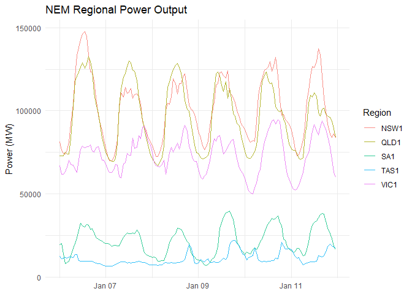
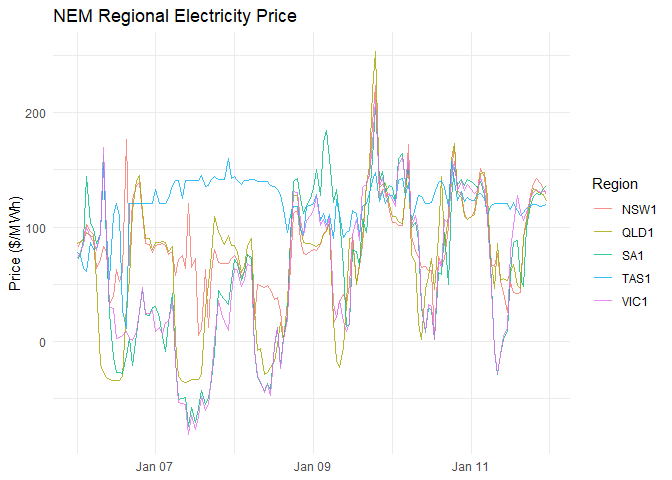
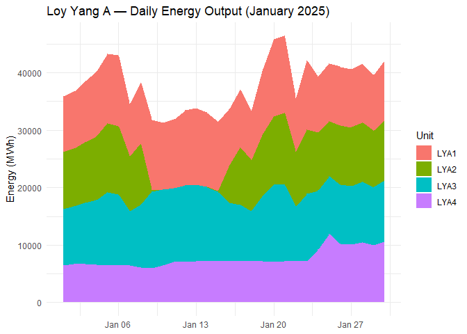

<!-- README.md is generated from README.Rmd. Please edit that file -->

# opennemr

<!-- badges: start -->

<!-- badges: end -->

## Overview

{opennemr} provides R access to the [OpenElectricity
API](https://openelectricity.org.au/) (v4), which publishes Australian
electricity market data for:

- **NEM** — National Electricity Market (eastern and southern Australia)
- **WEM** — Wholesale Electricity Market (Western Australia)
- **AEMO_ROOFTOP** — AEMO rooftop solar estimates
- **APVI** — Australian PV Institute solar data

The package is current as of **OpenElectricity API v4**.

## Installation

{opennemr} is not yet on CRAN. Install the development version from
GitHub:

``` r
# install.packages("devtools")
devtools::install_github("RPBatchelor/opennemr")
```

## API Key

All functions require an API key from OpenElectricity. Request access at
the [OpenElectricity developer
platform](https://platform.openelectricity.org.au).

Store your key in your R environment so it is never hard-coded in
scripts:

``` r
# Opens .Renviron — add the line below, then save and restart R
usethis::edit_r_environ()
# OPEN_ELECTRICITY_API_KEY=your_key_here
```

Verify your key is working:

``` r
library(opennemr)

oe_check_user()
```

## Functions

| Function | Description |
|----|----|
| `oe_check_user()` | Verify API key and view account details |
| `oe_get_facilities()` | Retrieve facility (power station) metadata |
| `oe_get_network_data()` | Network-level generation and emissions time series |
| `oe_get_network_market_data()` | Network-level market time series (price, demand) |
| `oe_get_facility_data()` | Facility-level time series data |

## Metric Availability by Function

Not all metrics are available from every endpoint. The table below shows
which metrics are supported by each function call. Unsupported
combinations return a 400 error from the API; {opennemr} will stop with
a clear message before making the request.

| Metric | `oe_get_network_data()` | `oe_get_network_market_data()` | `oe_get_facility_data()` |
|----|:--:|:--:|:--:|
| `power` | ✓ | ✓ | ✓ |
| `energy` | ✓ | ✓ | ✓ |
| `emissions` | ✓ | ✓ | ✓ |
| `price` | ✗ | ✓ | — |
| `demand` | ✗ | ✓ | — |
| `demand_energy` | ✗ | ✓ | — |
| `renewable_proportion` | ✗ | ✓ | — |

> **Note:** `market_value` is listed in the OpenElectricity API
> documentation but returns a 400 error from all endpoints as of API
> v4.4.12. It has been excluded from {opennemr} until the API supports
> it.

## Known Limitations

- **`oe_get_network_data()` supports one metric per call.** The API
  returns a 500 error when multiple metrics are requested
  simultaneously. Request metrics individually and combine the results.
- **`oe_get_network_data()` supports only NEM and WEM.** The
  `AEMO_ROOFTOP` and `APVI` networks return a 400 error from this
  endpoint.
- **`oe_get_network_market_data()` supports only NEM and WEM**, for the
  same reason.
- **Date range limits apply per interval.** Requests exceeding the limit
  for a given interval will prompt you to confirm before making multiple
  chunked API calls automatically. See `oe_data_limits` for the limits
  per interval.

## Reference Data

{opennemr} exports several datasets for exploring valid parameter
values:

``` r
oe_network_list        # Available networks
oe_network_regions     # Regions per network
oe_fueltechs           # Fuel technology codes
oe_fueltech_groups     # Fuel technology group codes
oe_metrics             # Available metrics and which endpoints support them
oe_intervals           # Valid time intervals
oe_primary_groupings   # Valid primary_grouping values
oe_secondary_groupings # Valid secondary_grouping values
oe_data_limits         # Maximum date range per interval
```

------------------------------------------------------------------------

## Examples

``` r
library(opennemr)
library(ggplot2)
```

------------------------------------------------------------------------

### Explore facilities

`oe_get_facilities()` returns a data frame of power stations and their
generating units. Filter by network, region, fuel technology, and
operational status.

``` r
wind_farms <- oe_get_facilities(
  network_id  = "NEM",
  fueltech_id = "wind",
  status_id   = "operating"
)
#> Fetched 99 records.

wind_farms[, c("code", "name", "network_region",
               "units_capacity_registered", "units_status_id")]
#> # A tibble: 110 × 5
#>    code     name       network_region units_capacity_registered units_status_id
#>    <chr>    <chr>      <chr>                              <dbl> <chr>          
#>  1 ARWF     Ararat     VIC1                               242.  operating      
#>  2 BHWF     Bald Hills VIC1                               107.  operating      
#>  3 BANGOWF  Bango      NSW1                               159   operating      
#>  4 BANGOWF  Bango      NSW1                                84.8 operating      
#>  5 BRYB1WF1 Berrybank  VIC1                               109   operating      
#>  6 BRYB1WF1 Berrybank  VIC1                               181.  operating      
#>  7 BIALAWF  Biala      NSW1                               110   operating      
#>  8 BLAYNEY  Blayney    NSW1                                 9.9 operating      
#>  9 BOCOROCK Boco Rock  NSW1                               113.  operating      
#> 10 BODWF    Bodangora  NSW1                               113.  operating      
#> # ℹ 100 more rows
```

------------------------------------------------------------------------

### Network generation by region

`oe_get_network_data()` returns generation time series aggregated across
a network. Supported metrics: `power`, `energy`, `emissions`. **One
metric per call.**

``` r
regional_power <- oe_get_network_data(
  network_code     = "NEM",
  metrics          = "power",
  interval         = "1h",
  date_start       = "2025-01-06",
  date_end         = "2025-01-12",
  primary_grouping = "network_region"
)
```

``` r
ggplot(regional_power, aes(x = datetime, y = value, colour = network_region)) +
  geom_line(linewidth = 0.4, alpha = 0.8) +
  labs(
    title  = "NEM Regional Power Output",
    x      = NULL,
    y      = "Power (MW)",
    colour = "Region"
  ) +
  theme_minimal()
```



------------------------------------------------------------------------

### Regional electricity prices

`oe_get_network_market_data()` returns price and demand time series.
Multiple metrics can be requested in a single call.

``` r
regional_prices <- oe_get_network_market_data(
  network_code     = "NEM",
  metrics          = "price",
  interval         = "1h",
  date_start       = "2025-01-06",
  date_end         = "2025-01-12",
  primary_grouping = "network_region"
)
```

``` r
ggplot(regional_prices, aes(x = datetime, y = value, colour = network_region)) +
  geom_line(linewidth = 0.4, alpha = 0.8) +
  labs(
    title  = "NEM Regional Electricity Price",
    x      = NULL,
    y      = "Price ($/MWh)",
    colour = "Region"
  ) +
  theme_minimal()
```



------------------------------------------------------------------------

### Facility-level generation

`oe_get_facility_data()` returns time series for individual generating
units within a facility. Multiple metrics can be requested in a single
call. Use `oe_get_facilities()` to find valid facility codes.

``` r
lya_energy <- oe_get_facility_data(
  network_code  = "NEM",
  metrics       = "energy",
  facility_code = "LOYYANGA",
  interval      = "1d",
  date_start    = "2025-01-01",
  date_end      = "2025-01-31"
)
```

``` r
ggplot(lya_energy, 
       aes(x = datetime, 
           y = value, 
           fill = unit_code)) +
  geom_area() +
  labs(
    title = "Loy Yang A — Daily Energy Output (January 2025)",
    x     = NULL,
    y     = "Energy (MWh)",
    fill  = "Unit"
  ) +
  theme_minimal()
```



------------------------------------------------------------------------

## Disclaimer

{opennemr} is not affiliated with the OpenElectricity team and has been
developed independently to provide straightforward R access to the API.
All data is provided subject to the restrictions and licensing
arrangements noted on the [OpenElectricity
website](https://openelectricity.org.au/).

------------------------------------------------------------------------

## Bugs, feedback and contributions

This package is in active development. Feedback and bug identification
is welcome. Issues or code contributions can be made via
[GitHub](https://github.com/RPBatchelor/opennemr).
